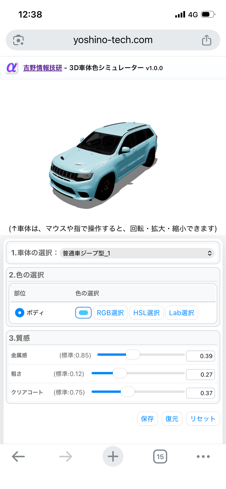

BCS3D

概要

BCS3Dは、WebGLを使用したブラウザ上で動作する3D Webアプリケーションです。

## スクリーンショット

デモ

https://yoshino-tech.com/bcs3d/

使用技術

* HTML
* CSS
* JavaScript
* WebGL

開発者

吉野情報技研
https://yoshino-tech.com/

今後の予定

* READMEの充実
